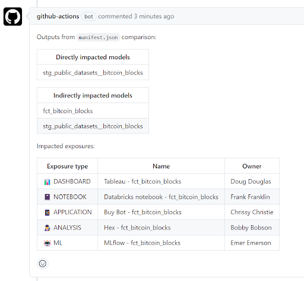
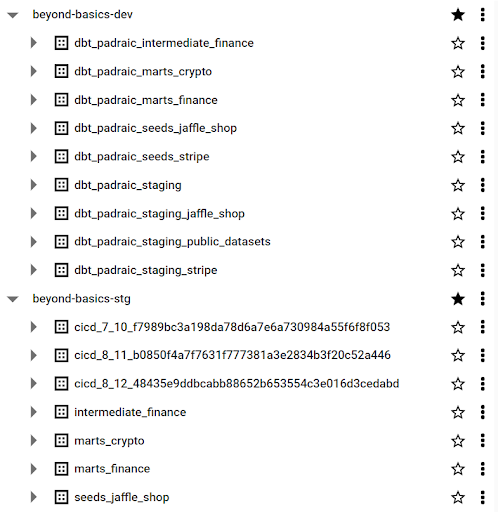

# dbt-beyond-the-basics


[](https://opensource.org/licenses/MIT)

A repository demonstrating advanced use cases of dbt in the following areas:

- [Continuous Integration (CI)](#continuous-integration)

    - [Pre-commit](#pre-commit)
    - [dbt Artifacts and Pytest](#dbt-artifacts-and-pytest)
    - [Coverage reports](#coverage-reports)
    - [dbt-bouncer](#dbt-bouncer)
    - [dbt commands](#dbt-commands)
    - [Using `state:modified`](#using-statemodified)
    - [Mart Monitor](#mart-monitor)

- [Continuous Deployment (CD)](#continuous-deployment)

    - [dbt Docs](#dbt-docs)
    - [Entity Relationship Diagram (ERD)](#entity-relationship-diagram-erd)
    - [Docker-ising dbt](#docker-ising-dbt)

- [Dev Containers](#dev-containers)

- [Python](#python)

    - [The `.python-version` file](#the-python-version-file)
    - [Package Managers](#package-managers)
    - [Caching in GitHub Workflows](#caching-in-github-workflows)

- [Others](#others)

    - [Running dbt from python](#running-dbt-from-python)
    - [Conferences](#conferences)

- [References](#references)

See something incorrect, open an [issue](https://github.com/pgoslatara/dbt-beyond-the-basics/issues/new)!

Want to see something else included, open an [issue](https://github.com/pgoslatara/dbt-beyond-the-basics/issues/new) 😉!

# Continuous Integration

Continuous Integration (CI) is the process of codifying standards, these range from formatting of file contents to validating the correctness of generated data in a data warehouse.

## Pre-commit

[Pre-commit](https://pre-commit.com/) provides a standardised process to run some basic tests (generally formatting and linting) before committing to your local branch. This has several benefits, primarily providing the developer with a quick feedback loop on their work as well as ensuring changes that do not align with standards are automatically identified before being merged. Pre-commit operates via hooks, all of these hooks are sepecified in a `.pre-commit-config.yaml`file.

To install `pre-commit` run:

```shell
uv pip install pre-commit
```

Then install the hooks specified in your `.pre-commit-config.yaml` file:

```shell
pre-commit install
```

There are several hooks that are relevant to a dbt project:

- [Pre-commit](https://github.com/pre-commit/pre-commit-hooks) itself provides several standard hooks that ensure standard behaviour regarding whitespace control, valid YAML files, no presence of private keys and no unresolved merge conflicts. An interesting hook is `no-commit-to-branch`, this allows the name of the git branch to be standarised, for example to always start with `feature/` or to always include a Jira ticket ID to help with tracking of work items.

    ```yaml
    # .pre-commit-config.yaml
    - repo: https://github.com/pre-commit/pre-commit-hooks
        rev: v4.4.0
        hooks:
        - id: trailing-whitespace
        - id: check-merge-conflict
        - id: check-yaml
            args: [--unsafe]
        - id: no-commit-to-branch
            name: JIRA ticket ID in branch
            args: ['--pattern', '^((?![A-Z]+[-][0-9]+[-][\S]+).)*$']
    ```

- [sqlfmt](https://github.com/tconbeer/sqlfmt) is the SQL formatter used in the dbt Cloud IDE. It is an opinionated formatter with minimal configuration options making it super easy to setup. It forces all `.sql` files to a standard SQL format thereby reducing the strain on repo readers by having a single, standard format across the repo. An alternative is [SQLFluff](https://docs.sqlfluff.com/en/stable/production.html#using-pre-commit), which also has pre-commit hooks.

    ```yaml
    # .pre-commit-config.yaml
    - repo: https://github.com/tconbeer/sqlfmt
        rev: v0.18.1
        hooks:
        - id: sqlfmt
    ```

For an example `.pre-commit-config.yaml` file, see the [file](https://github.com/pgoslatara/dbt-beyond-the-basics/blob/stg/.pre-commit-config.yaml) in this repository.

### The advantage of local hooks

Most pre-commit hooks are "isolated" hooks in the sense that pre-commit creates a dedicated, isolated environment for each hook to run in. In effect this means that the python environment the hook runs in is not the same as the python environment you are working in locally.

For example, you `uv pip install` the `sqlfmt` package and your local environment now has version `0.23.0` installed. You may run `sqlfmt models` to format your dbt models after making some changes. When you are ready to commit your changes pre-commit also runs `sqlfmt`, however it will use a different python environment to do so, potentially resulting in conflicting changes.

One way to avoid this is to use `local` hooks. These are hooks that run in the same python environment that you are developing in. For example, this "isolated" hook:

```yaml
# .pre-commit-config.yaml
- repo: https://github.com/tconbeer/sqlfmt
    rev: v0.24.0
    hooks:
    - id: sqlfmt
```

Can be changed to:

```yaml
# .pre-commit-config.yaml
- repo: local
hooks:
    - id: sqlfmt
    entry: python -m sqlfmt
    language: system
    name: Run sqlfmt
    pass_filenames: true
    types_or: [jinja, sql]
```

The primary advantage of this change is that your local environment and pre-commit are now configured to use the same python environment and the same `sqlfmt` version. A tangential benefit is that updates to packages used in pre-commit now only require updating of the python package. Previously this would have required updating both the python package and the pre-commit hook, a process which if not done correctly could result in a mis-matched setup.

### prek: a faster alternative to pre-commit

[prek](https://github.com/j178/prek) is a drop-in replacement for `pre-commit`, re-engineered in Rust. It reads the same `.pre-commit-config.yaml` files so switching requires no configuration changes. Key advantages include:

- **Speed**: prek executes significantly faster than `pre-commit`. Repositories are cloned in parallel, hooks are installed in parallel when their dependencies are disjoint, and hooks can run concurrently by priority.
- **No Python dependency**: prek ships as a single binary — no need to install Python or any other runtime. It automatically installs the required Python version and creates a virtual environment for hooks that need one.
- **Lower disk usage**: prek uses approximately half the disk space of `pre-commit` for cached hook environments.
- **Monorepo support**: built-in support for workspaces where each subproject can have its own `.pre-commit-config.yaml` file.
- **Built-in hooks**: prek implements several common hooks natively in Rust, making them faster than their Python counterparts.

To install `prek`:

```shell
# macOS / Linux
brew install j178/tap/prek

# Or via pip / uv
uv pip install prek
```

Then install the hooks (same command as `pre-commit`):

```shell
prek install
```

Run hooks manually with:

```shell
prek run --all-files
```

prek is already used by projects such as CPython, Apache Airflow, and FastAPI. For more details, see the [prek documentation](https://prek.j178.dev/).

## dbt Artifacts and Pytest

dbt produces 4 artifacts in the form of JSON files:

- `catalog.json` is produced by `dbt docs generate` and contains all the information displayed in the docs web UI (primarily model schemas and data types).
- `manifest.json` is produced by `dbt compile` and is the main source of information for the project including details on all nodes, the dependencies between these nodes as well as both the raw and compiled SQL that will be run.
- `run_results.json` is produced by any dbt command that runs a node, e.g. `dbt build`, `dbt run`, etc. It contains data on the success of each node, the duration of each node and any data returned by the warehouse (adapter responses).
- `sources.json` is produced by `dbt source freshness`, similar to `run_results.json` it contains data on how long each freshness check takes as well as the success or failure of the check.

All artifacts are saved in the `./target` directory by default.

These JSON files provide a valuable resource when it comes to understanding our dbt project and codifying standards. To run tests on these these files we use [pytest](https://docs.pytest.org/en/7.3.x/), a python based testing framework:

- Create a fixture for each artifact:

    ```python
    # ./tests/pytest/conftest.py
    @pytest.fixture(scope="module")
    def catalog_json() -> dict:
        with Path("./target/catalog.json").open() as f:
            data = json.load(f)
        return data
    ```

- Write a pytest that takes a fixture as an input parameter and runs as `assert` statement:

    ```python
    # ./tests/pytest/test_columns.py
    @pytest.mark.catalog_json
    def test_column_names_models(catalog_json: dict) -> None:

        regex_pattern = "[a-z_0-9]*"

        for k, v in catalog_json["nodes"].items():
            for col in v["columns"].keys():
                if col.find(".") <= 0:
                    assert (
                        col == re.compile(regex_pattern).match(col)[0]
                    ), f"Column '{col}' in {k} does not align with the existing naming convention ({regex_pattern})."
    ```

    Using the `@pytest.mark` decorator and creating a `pytest.ini` file allow us to use marks to group pytests, for example grouping all pytests that use the `catalog.json` artifact.

The most valuable artifacts for this are `catalog.json` and `manifest.json`. Example tests include:

- A naming convention for columns, e.g. no uppercase characters.
- Each source can only be read by one staging model.
- All columns with a data type of DATE have to end with "_date".
- The `./model/staging` directory can only have 1 layer of subdirectories.
- Etc.

These tests can (and should) be run in the CI pipeline:

```yaml
# ./.github/workflows/ci_pipeline.yml
- run: pytest ./tests/pytest -m no_deps
```

They can also be run as a pre-commit hook:

```yaml
# .pre-commit-config.yaml
- repo: local
    hooks:
    - id: pytest-catalog-json
        name: pytest-catalog-json
        entry: pytest ./tests/pytest -m catalog_json
        language: system
        pass_filenames: false
        always_run: true
```

## Coverage reports

Some of the functionality discussed above in [dbt Artifacts and Pytest](#dbt-artifacts-and-pytest) can be automated using [dbt-coverage](https://github.com/slidoapp/dbt-coverage). This is a python package that produces coverage reports for both documentation and, separately, for tests. All pull requests in this repo will have a comment that provides these stats. This allows PR reviewers to quickly assess if any newly added models are lacking acceptable documentation or test coverage.

## dbt-bouncer

As an alternative to running `pytest` in our CI pipeline we can instead use [`dbt-bouncer`](https://github.com/godatadriven/dbt-bouncer). This is a python package that runs a series of checks on a dbt project.

Running `dbt-bouncer` involves three steps:

1. Install the package:
    ```bash
    uv pip install dbt-bouncer
    ```

2. Create a `dbt-bouncer.yml` configuration file, see [dbt-bouncer.yml](./dbt-bouncer.yml) for an example. This file lists all the checks we want to apply to this dbt project.

3. Run the `dbt-bouncer` command (locally or in a CI pipeline):

    ```bash
    dbt-bouncer
    ```

## dbt commands

Any CI pipeline should run several dbt commands:

- `dbt build`: This runs and tests all the models, ideally in a dedicated schema (set up via the `generate_schema_name` macro).
- `dbt build --select config.materialized:incremental`: This runs and tests all incremental models, this is an important step to ensure any incremental logic does not generate invalid SQL.
- `dbt source freshness`: This tests the freshness of all sources. The output of this command should be forced to success (via `|| true`) as we are not interested in whether our sources are fresh, we are interested in the generated `source.json` artifact. See `./test/pytest/test_sources.py` for an example of how to identify invalid freshness checks.

All `build` commands should make use of the following flags:

- `--warn-error`: Any warning results in a failure. This ensures no warnings enter our production branch as these have a higher likelihood to result in failures in the future or be an unintended consequence of the changes in the PR.
- `--fail-fast`: Any failed node results in the immediate failure of the command. This provides faster feedback to the developer who is waiting on the results of the CI pipeline.

An example `dbt build` command as part of the CI pipeline:

```yaml
# ./.github/workflows/ci_pipeline.yml
- run: dbt --warn-error build --fail-fast
```

## Using `state:modified`

As part of the CI pipeline the `manifest.json` artifact is generated for the feature branch, this can be compared to the `manifest.json` of the target branch using the [state](https://docs.getdbt.com/reference/node-selection/methods#the-state-method) method to identify any nodes that have been modified. In addition, the use of the `state:modified+` flag allows all downstream nodes to also be identified. When combined with exposures and comments in the PR this can help reviewers quickly assess the potential impact of a PR.



## Mart Monitor

A popular approach to CI for dbt is running [Slim CI](https://docs.getdbt.com/docs/deploy/cloud-ci-job#configuring-a-slim-ci-job), this runs the modified nodes and all downstream nodes. This has the benefit of only testing modified nodes and therefore reducing run times and operational costs.

In certain setups it may be desireable to run the entire dbt project in every CI pipeline run. While this sounds extreme there are several methods that can be used to retain the benefits of Slim CI while benefiting from other advantages, namely the ability to provide comprehensive feedback on the impact of a PR on mart models. This can be performed via several steps:

- Add or edit the `generate_schema_name` macro to force all models to be built in a single schema when the `DBT_CICD_RUN` environment variable is `true`.

    ```sql
    # ./macros/generate_schema_name.sql
    

         {{ env_var('DBT_DATASET') }}

        

            {{ node.config.schema }}

         {{ default__generate_schema_name(custom_schema_name, node) }}

        

    

    ```

    This results in a scenario where each CI pipeline run has a dedicated dataset:

    

- For staging models with large volumes of historical data there is no need to process all this data in every CI pipeline run. A jinja "if" condition can be utilised to only use a reasonble volume of data during CI runs:

    ```sql
    # ./models/staging/public_datasets/stg_public_datasets__bitcoin_blocks.sql
    

        and timestamp_month >= date_trunc(date_sub(current_date(), interval 1 month), month)

    
    ```

- In `.github/workflows/ci_pipeline`, set the required environment variables:

    - Set `DBT_CICD_RUN` to `true`.

    - Assemble the value of `DBT_DATASET` to contain the PR number, run number and sha of the latest commit. This ensures that every run of the pipeline will have a unique schema.

- Add a query to `./scripts/mart_monitor_queries.yml` that returns a single row of values. This query can test any model and contain any logic however it is best to start with examing high level summaries of mart models as these are the most critical models in a dbt project.
- In the CI pipeline (`.github/workflows/ci_pipeline`) run `dbt build` and run the `./scripts/mart_monitor_commenter.py` script passing the required arguments.
- For each mart monitor query a comment will be left in the PR to help developers and reviewers quickly assess the impact of the changes on mart models:

.](./images/mart-monitor-red.png)

.](./images/mart-monitor-green.png)

A downside of building all models in a CI pipeline is increased run time and resource consumption. This can be restricted via pytests based on the `run_results.json` artifact. See `./tests/pytest/run_results.py` for examples of how the duration and resource consumption of `dbt build` in the CI pipeline can be set to have reasonable allowable values. This provides a number of benefits:

- Poor JOIN logic that takes excessive time to compute will be identified.
- Incorrect or non-use of partitioning to select source data will result in failed CI pipelines.
- As a project grows there is continuous focus on the efficiency of CI runs resulting in a developer mindset that places efficiency higher in the priority list.


# Continuous Deployment

## dbt Docs

dbt Docs is a static website that exposes all documentation relating to your dbt project. Normally this is generated and served locally via:

```bash
dbt docs generate
dbt docs serve
```

This works well for the dbt developer as their local python environment is already set up to support these commands. But this isn't an option for some data consumers like the head of marketing who wants to understand what a metric means or a financial analysts looking for the most suitable table to query. For these data consumers we can expose the dbt Docs website via a web server, in our case we can use [GitHub Pages](https://pages.github.com/).

Every time we push to our `prd` branch, the [cd_dbt_docs.yml](https://github.com/pgoslatara/dbt-beyond-the-basics/blob/prd/.github/workflows/cd_dbt_docs.yml) workflow is triggered. This workflow runs the above dbt commands and uses the [peaceiris/actions-gh-pages](https://github.com/peaceiris/actions-gh-pages) GitHub Action to expose the generated dbt Docs website.

GitHub Pages is awesome as it is free for personal, public repositories (like this repository) and also for organisations with an Enterprise plan. If your organisation has GitHub Pages, these are placed behind the same SSO as your GitHub repositories, providing a safe way of exposing dbt Docs to members of your organisation. If you do not use GitHub, there are many alternatives available such as Cloudflare and Netlify, in addition AWS, Azure and GCP can all serve static websites from their cloud storage products.

## Entity Relationship Diagram (ERD)

An entity relationship diagram (ERD) is a visual representation of the relationships between entities in a database. It is a useful tool for understanding the structure of a database and can be used by dbt developers when adding new features and also by analysts when writing queries to answer business questions. For a dbt project, only the `marts` layer is exposed to end users, hence the ERD only needs to include this layer. Here is the ERD for this dbt project (it's rather basic, a real-world dbt project would have a significantly busier ERD):


How is this created?

1. In our `marts` layer we have defined `relationships` tests. For example, the `customer_id` column in `dim_customers` is related to the `customer_id` column in `dim_orders`.

1. Using [dbterd](https://github.com/datnguye/dbterd) we can generate a [mermaid](https://github.blog/developer-skills/github/include-diagrams-markdown-files-mermaid/) diagram of the `marts` layer including the `relationships`.

1. Using [mermaid-py](https://github.com/ouhammmourachid/mermaid-py) we can convert the mermaid diagram to a png image.

1. Combining the last two steps into a single python script: [./scripts/generate_marts_erd_diagram.py](./scripts/generate_marts_erd_diagram.py).

1. Now the tricky part. I want this diagram in the `README` of my repository. But I don't want every developer to have to run this script before creating their PR, I want the image to be automatically generated and kept up to date. So I do the following:

    1. Using the [cd_erd_diagram.yml](./.github/workflows/cd_erd_diagram.yml) workflow I trigger a GitHub workflow after every merge to `prd`.

    1. This workflow runs the script and generates the ERD image.

    1. The image is then force-pushed to the `erd-diagram` branch. Why? The `prd` branch has branch protection rules that prevent force pushes (this is good practice), so pushing to a different branch avoids this.

    1. I now have an automatically updated ERD available at a static URL:

        ```shell
        https://github.com/pgoslatara/dbt-beyond-the-basics/blob/erd-diagram/target/mermaid.png?raw=true
        ```

        This is the URL I reference for the above image.

## Docker-ising dbt

"Docker-ising" refers to building a Docker image that can run your dbt project. This is useful when your orchestration process involves running a command in a pre-built container, think Airflow, Cloud Build, Dagster or any other modern Cloud orchestration tool. When building a Docker image for dbt we want to follow several guidelines:

* The image should be as small as is reasonable achievable. Given that our orchestrator may pull the image many times over the course of a single day (e.g. hourly runs or one pull per task), having a smaller image reduces the amount of data that needs to moved (and resulting wait times and cloud costs). There are several ways to achieve this:
    * As the base image, use a "slim" python image rather than a "full" image.
    * If you use a python package manager like uv, use [multi-stage builds](https://docs.docker.com/build/building/multi-stage/). This allows your image to be built using uv but does not include uv in the final image (as it is not necessary to run dbt).
    * Only install the python dependencies you need, i.e. no dev dependencies.
* The image should not contain any sensitive data like passwords or credentials. If these are required, they should be passed at build time as [build secrets](https://docs.docker.com/build/building/secrets/).
* The image should make good use of Docker layers and caching to reduce the time it takes to build the image. The [docker/build-push-action](https://github.com/docker/build-push-action) natively supports caching Docker layers in GitHub Actions.
* The image should not require any setup commands to be used. For dbt this means that the image already contains all required dbt packages and the dbt project has been parsed.

In CI, the [ci_pipeline.yml](./.github/workflows/ci_pipeline.yml) workflow builds a Docker image and runs a `dbt parse` command on it to validate that the image can run dbt commands.

In CD, although not implemented in this repository, the `docker/build-push-action` GitHub Action can be used to push the image to an image registry such as GCP's Artifact Registry or AWS's ECR. From here the image can be downloaded by your orchestration tool. It is common to tag images with the SHA of the commit that built the image, in addition you can tag images with the environment they are intended to be used in. For example, an image will initially have the commit SHA and `stg` tag, it will then be used in our staging environment, after a deployment the `stg` tag will be replaced with a `prd` tag and the image will be used in production. When a subsequent deployment to production is performed the `prd` tag is re-assigned to a newer image and the original image retains only its SHA tag. At all times there is one image with a `stg` tag and one image with a `prd` tag. Immediately after a deployment from staging to production, one image will have both tags (i.e. staging and production will use the same image).

# Dev Containers

[Dev containers](https://containers.dev/) provide a Docker-ised development environment and are natively supported by both PyCharm and VSCode, allowing developers to continue using their preferred IDE. Using a dev container allows all developers to work in a standardised environment (including VSCode extensions!), minimising setup issues, reducing the need for manual configuration and allowing for a consistent development experience. Dev containers are useful in workplaces where developers use different OS's (think Mac and Windows), where developers may not be familiar with setting up python environments and where connecting to the underlying database requires non-standard configuration (SQL Server sometimes requires specific drivers to be installed). You can even use the [devcontainers/ci](https://github.com/devcontainers/ci) Github Action to use your standardised dev container in your GitHub workflows.

To use a dev container you must have [Docker](https://docs.docker.com/engine/install/) (or another container manager like [Podman](https://code.visualstudio.com/remote/advancedcontainers/docker-options#_podman)) installed, while some workplaces may restrict this due to security concerns, container managers are very widely used engineering tools and when used correctly can be used for more than just dev containers.

To view the dev container configuration for this project, view the [.devcontainer](https://github.com/pgoslatara/dbt-beyond-the-basics/tree/stg/.devcontainer) directory.

To open this repository in a dev container:

1. Click this button: [](https://vscode.dev/redirect?url=vscode://ms-vscode-remote.remote-containers/cloneInVolume?url=https://github.com/pgoslatara/dbt-beyond-the-basics)

1. Clone this repo to your local machine, open the repository in VSCode and from the command palette select `Dev Containers: Reopen in Container`.

# Python

dbt runs in a python environment, therefore the configuration of your python environment is a critical part of a dbt project.

## The `.python-version` file

There are many different versions of python, and there are many different parts of a dbt project that require access to python. One widely supported way of managing the python version is to create a `.python-version` file in the root of your project. This file contains the python version you want to use, and is as simple as:

```shell
3.11.10
```

Python has a large ecosystem of tools, many of these will use the `.python-version` file if it is present:

* `actions/setup-python`: A GitHub Action that installs python in the ephemeral environment used by a GitHub workflow.
* `pyenv`: A tool for installing multiple versions of python.
* `uv`: A package manager for python.

## Package Managers

This repository uses [uv](https://docs.astral.sh/uv/) as a python package manager. Package managers are used to install and manage python packages, one of their primary benefits is the generation of a lock file, a file detailing the exact version of every installed package. For uv, this is the `uv.lock` file. This helps control what are known as transitive dependencies, dependencies that are installed as a result of installing a package. For example, if I was using `pip` to install packages I may specify `dbt-core>=1.8,<1.9`. With uv I would specify `dbt-core (>=1.8.0,<1.9.0)`. The installed version of `dbt-core` will be the same using both methods. However `dbt-core` has dependencies (such as `click`, `logbook`, etc.). With `pip` I have no control over the version of these dependencies, with uv I do as the lock file ensures even these dependencies are recorded.

## Caching in GitHub Workflows

GitHub workflows initialise in an almost empty environment, just your repository contents and some standard CLI tools (think `gh`, GitHub's own CLI tool). One common step is to recreate the python virtual environment in the workflow environment. This involves downloading and installing all the python dependencies into the `.venv` directory. But what if you are re-running a CI workflow, or what if your dependencies are the same as your previous run? In these cases you are repeating work that has already been done.

One way to avoid this is to use caching, the concept of storing the output of your work and reusing it in a later run. GitHub Actions has a built in caching mechanism, you can specify a cache key and a path to cache. You can even view the existing caches for this repo [here](https://github.com/pgoslatara/dbt-beyond-the-basics/actions/caches).

dbt repositories can benefit from caching in the python virtual environment stored in `.venv`.

This is the result of work we perform in almost every GitHub workflow run. And this can be easily invalidated when necessary; the virtual environment when the contents of `uv.lock` change.

To enable caching, let's take an example workflow snippet:

```yaml
env:
  UV_VERSION: "0.9.24"

jobs:
  auto-update:
    runs-on: ubuntu-latest
    steps:
      - uses: actions/checkout@v4

      - name: Install uv
        uses: astral-sh/setup-uv@v7
        with:
          enable-cache: true
          version: ${{ env.UV_VERSION }}

          enable-cache: true
      - name: Install python packages
        run: uv sync

      - name: Whatever else we want to do
        run: ...
```

The `astral-sh/setup-uv` action handles the installation of uv and the caching of the virtual environment. It automatically generates a cache key based on the `uv.lock` file and the OS.

# Others

## Running dbt from python

In version 1.5, dbt introduced [programmatic invocations](https://docs.getdbt.com/reference/programmatic-invocations), a way of calling dbt commands natively from python including the ability to retrieve returned data. Previous ways of doing this mostly relied on opening a new shell process and calling the dbt CLI, this wasn't ideal for a lot of reasons including security. This repo further abstracts programmatic invocations to a dedicated helper function, see `run_dbt_command` in `./scripts/utils.py`.

## Conferences

This repository accompanies some conference talks:
- [NL dbt meetup: 2nd Edition](https://www.meetup.com/amsterdam-dbt-meetup/events/293640417/): "CI for dbt: Beyond the basics!", slides available [here](https://docs.google.com/presentation/d/1Y5fx4h97IY0wpsutt92nPLO1UDUcrq6YdVKt-UuL93c/edit#slide=id.p).
- [MDSFest](https://www.linkedin.com/events/7091868349487353856/): "CI for dbt: Beyond the basics!", slides available [here](https://docs.google.com/presentation/d/1M0475jIX41uxT-nLPWlymUkstuUzkq-LppZqT_o759Q/edit#slide=id.g260e469f8e9_0_7), video available [here](https://www.youtube.com/watch?v=bRKk6F07G58).

# References

- [GitLab dbt Guide](https://handbook.gitlab.com/handbook/enterprise-data/platform/dbt-guide/): a comprehensive and regularly updated guide covering GitLab's approach to dbt, including project structure, style conventions, testing strategies, and CI/CD patterns.
